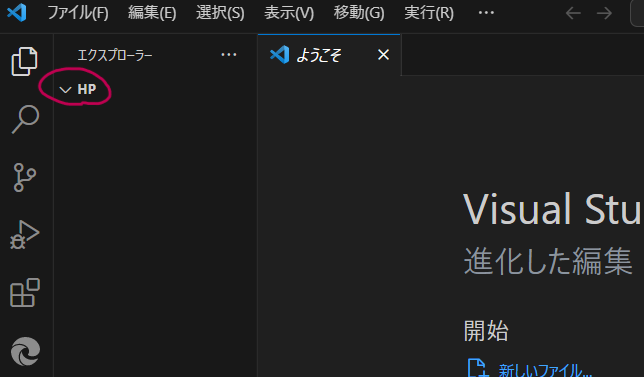
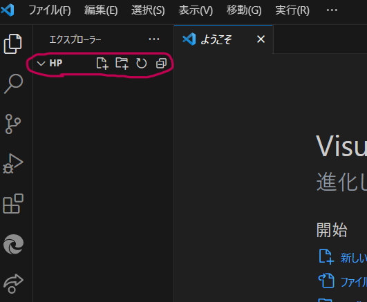
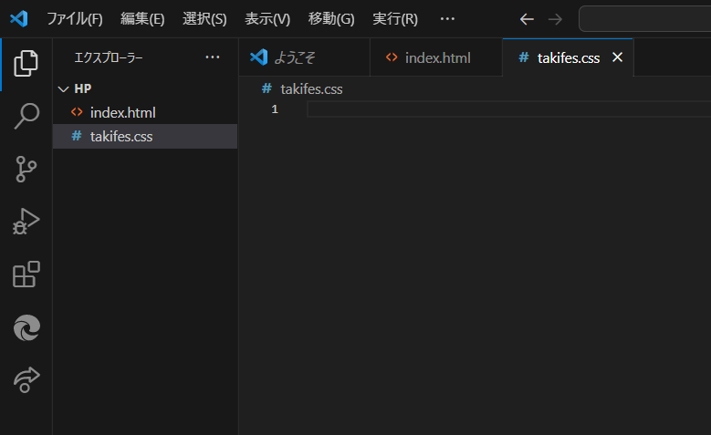
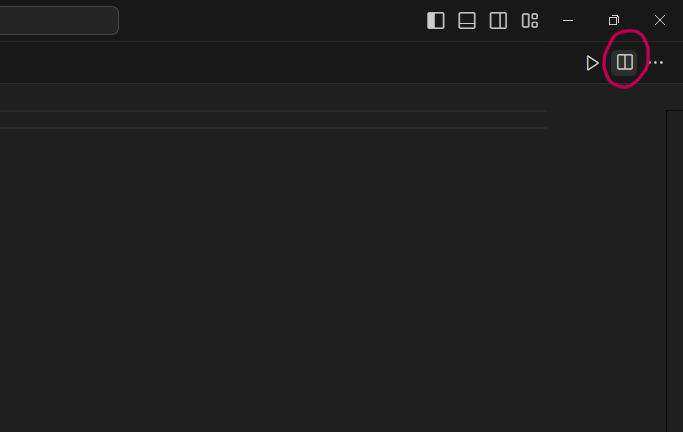

#   目標物の確認・ファイル作成
　ここからは、実際にwebページを作ってもらいながらHTML/CSSの説明をします。作ってもらうページは、23Tが最初につくった[Taki Fes 2023](https://tpgd.jp/whatsnew/20230621_takifes/index.html)です。

　ホームページの画面構成は大きくわけてヘッダー、メイン部分、フッターの3つです。ヘッダーは画面上部のWhat's New、About usなどのボタンが並んでいる部分、フッターはページ下部のSNS情報などが書いてある部分で、それ以外の部分がメイン部分です。

　まず、コードを書いていくためのHTMLファイルとフォルダをつくります。

　エクスプローラーを開き、ドキュメントの好きな場所に「HP」というフォルダを作成します。

　次にVScodeを開き、左上の「ファイル」から「フォルダーを開く」をクリックします。先ほど作成した「HP」フォルダを選択してください。

　上のように「HP」と表示されていればOKです。

　印のあるあたりにカーソルを持って行くと画像のように4つボタンが現れるので、一番左のボタンをクリックしてください。すると下に入力欄ができるので、HTMLファイルの名前を入力しenterを押すと作成されます。今回は「index.html」にしましょう。最後のhtmlというのは拡張子です。また、この先もそうですがファイルやフォルダ名には日本語を使わず、アルファベット、数字、アンダーバー(_)表記にしてください。

　TPGのHPを管理する上で定めてある基準がいろいろあるのですが、それは<a href="#">こちら</a>にまとめておきます。必要になったときに参照してください。今回はフォルダが一つですが、実際にTPGのHPをいじる場合はフォルダが大量にあるため、ファイルを作成するとき作成場所を誤らないように気をつけてください。

　これでHTMLファイルは作成できたので、ここからはこのindex.htmlファイルにコードを書いていきます。

　その前に、CSSファイルも作成しておきます。先ほどHTMLファイルを作成したのと同様の流れで作成してください。ファイル名は「takifes.css」にしておきます。 

　このようになっていれば大丈夫です。実際に書くコードについては次のページから説明します。

　その前に、作業しやすいように画面を整えておくことを勧めます。

　画面の右上にこのようなボタンがあるので、1回クリックします。すると画面が2分割されます。私は基本的に左にHTML、右にCSSファイルを置いて同時に見ながら作業するのがやりやすいです。ただの個人的こだわりなので好きにやってください。