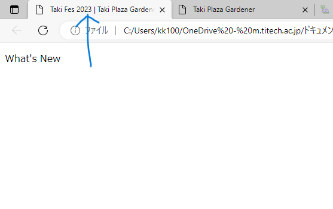
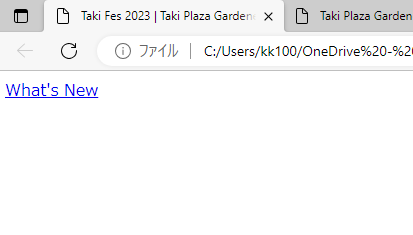
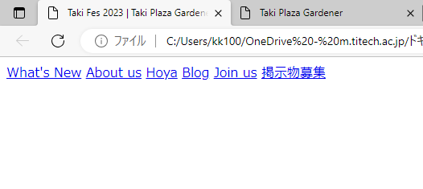

# ヘッダーの作成 ① 　文字・リンクの作成方法

では、ヘッダーをつくっていきます。

　まず、文字を表示させることにします。p タグで文字を表示させることができます。header タグの中に、p タグを作りそのなかに What's New と入れてください。


```html
<header>
  <p>What's New</p>
</header>
```


　作成しているページをブラウザで見るには、エクスプローラーで「HP」フォルダを開き、index.html というファイルをダブルクリックします。

　すると、ブラウザが開き、このように左上に What's New と表示されます。タブ(青印部分)が前ページで設定したように Taki Fes ~ になっているのもついでに確認できます。




　一方、<a href="https://tpgd.jp/whatsnew/20230621_takifes/index.html">目標物のページ</a>ではヘッダーの文字はリンクになっています。


　先ほど書いた p タグの開始か終わりのどちらかを、a に変えてみてください。Auto Rename Tag というプラグインのおかげで、自動で開始タグと閉じタグの両方が a に置き換わるはずです。そして、開始タグにはリンク先となるページのリンクを書きます。

　次のように書いてください。href 以降の" "の間にリンク( https://tpgd.jp/whatsnew/20230621_takifes/index.html )を書きます。

```html
<a href="https://tpgd.jp/whatsnew/20230621_takifes/index.htmll">What's New</a>
```


先ほどのブラウザを再読込みすると、What's New の文字が次の画像のようにリンクっぽくなっています。実際にクリックすると TPG の What's New のページに飛べます。




同様にして、他のボタンも作ってしまいましょう。次のようなコードが書けて、表示ができていれば大丈夫です。

```html
<header>
  <a href="https://www.tpgd.jp/whatsnew/index.html">What's New</a>
  <a href="https://www.tpgd.jp/index.html#aboutus">About us</a>
  <a href="https://www.tpgd.jp/hoya/index.html">Hoya</a>
  <a href="https://www.tpgd.jp/blog/index.html">Blog</a>
  <a href="https://www.tpgd.jp/joinus/index.html">Join us</a>
</header>
```


