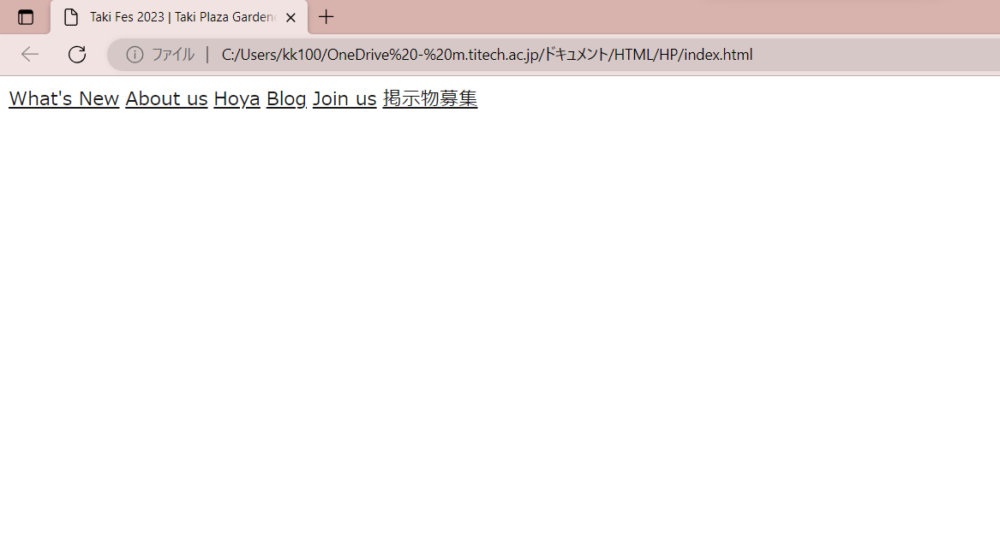

# ヘッダーの作成 ② 　文字色・フォントサイズの指定/クラスについて

今回は、文字色やフォントサイズの指定をします。最初に作成した takifes.css を開きます。個人的には画面分割(<a href="/learn/website/w01_intro/003/README.md">参照</a>)して作業するのがおすすめです。

CSS を書き始める前に、この CSS ファイルがどの HTML ファイルへの装飾を施しているのかという紐付けをしておく必要があります。今回はファイルを作成したときにすでにやってあるので飛ばしますが、結構忘れがちなので気をつけてください(なぜか CSS が全く反映されないなあと思ったら大体これ説あります。ファイル名やパスの誤りの可能性もあります。)


CSS では、文字化け防止のために次の一行を冒頭に書いておきましょう。

```css
@charset "utf-8";
```


　先に完成したコードを載せます。

```css
@charset "utf-8";
.header_item {
  font-size: 1.2vw;
  color: #181818;
}
```


　 CSS の基本の書き方はこのようになります。{ }の前の項目はセレクタといい、HTML 内のどの要素への指定かを宣言します。今回であれば、.header_item という要素への指定ということです。

　：の前の項目はプロパティといい、何の指定をするかを宣言しています。font-size はフォントサイズ、color は文字色を指定するよ、ということです。

　：(コロン)と；(セミコロン)の間の項目は値とよび、指定したい内容を書きます。今回は文字サイズを 1.2vw、文字色をカラーコード#181818 の色に指定しています。vw という単位については[後ほど説明](/learn/website/w01_intro/006.5/README.md)します。

　まとめると、セレクタ、プロパティ、値はそれぞれ「どこの」「何を」「どうする」という指定に対応しています。


　ここで大きな問題として、そもそも現時点で「.header_item」というものは HTML に存在しません。今文字色やサイズを指定したい要素は、header タグの中にある a タグの要素です。CSS のセレクタとして、「a」と書けば a タグすべてに指定が適用されます。

　しかしそれでは今後ページを作っていく中で、a タグの要素の文字色などを変えたくなったときにも同じ指定が適用されてしまいます。


　そこで必要となってくるのがクラスという概念です。

　セレクタにタグ名(a, p など)を書いて装飾をつけていくのでは細かな変更ができないため、a タグとして呼び出すのではなく特定の要素を自由に呼び出せる必要があります。そこで、HTML に書いた各要素にクラス属性というものを与え、そのクラスを CSS で呼び出してあげます。


　 HTML の方で、a タグに header_item というクラスを追加します。href="(リンク)"の後に、`class="header_item"`と書きます。これをすべての a タグにコピペしてください。


　注意点として、セレクタにクラスを指定するときは、前に「.(ドット)」をつけるのを忘れないでください。


　今回までで書いたコードは次の通りです。

#### HTML ファイル

```html
<!DOCTYPE html>
<html>
  <head>
    <title>ページのタイトル</title>
    <meta name="viewport" content="width=device-width, initial-scale=1.0" />
    <meta charset="UTF-8" />
    <link rel="stylesheet" href="読み込みたいCSSファイルのパス" />
  </head>
  <body>
    <header>
      <a href="https://www.test.tpgd.jp/whatsnew/index.html" class="header_item"
        >What's New</a
      >
      <a href="https://www.test.tpgd.jp/index.html#aboutus" class="header_item"
        >About us</a
      >
      <a href="https://www.test.tpgd.jp/hoya/index.html" class="header_item"
        >Hoya</a
      >
      <a href="https://www.test.tpgd.jp/blog/index.html" class="header_item"
        >Blog</a
      >
      <a href="https://www.test.tpgd.jp/joinus/index.html" class="header_item"
        >Join us</a
      >
    </header>

    <footer></footer>
  </body>
</html>
```

#### CSS ファイル

```css
@charset "utf-8";
.header_item {
  font-size: 1.2vw;
  color: #181818;
}
```

#### 現時点での表示


