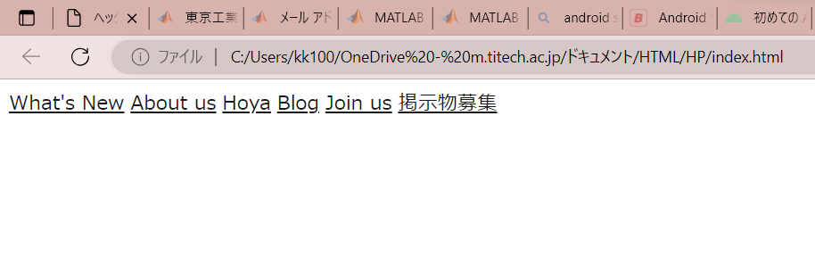

#  ヘッダーの作成 ③ ヘッダーの領域をつくる
　次にやることはヘッダーの文字を等間隔に広げたり、一番左にTPGのアイコン画像を置いたりといくつか考えられますが、とりあえずヘッダーの領域を作ってしまいます。

目標物を確認すると、ヘッダーとして白い領域が画面幅分広がっており、領域の下に緑の線が引いてあります。この領域の高さは90pxなので、次のCSSを書きます。

書く場所は前回作成した.header_itemの前にしましょう。基本的にはHTMLファイル上で上にある項目から、そして外側にある項目から順にCSSが並ぶように書くとわかりやすいと思います。
```css
header {
    width: 100%;
    height: 90px;                
}
```
ページの見た目はこのようになっています。



これでは、高さ90px・横幅100％の領域がつくれたかどうかが確認できないため、目標物と同じように下線をつけます。ついでに、背景色の白も指定します。
```css
header {
    width: 100%;
    height: 90px;
    background-color: #fff;
    border-bottom: 2px solid #BADA55;     
}
```
　文字から少し下に下線がつきました。画面上部からこの下線までの高さが90pxです。画面に対するpxやvwの大きさの感覚をつかんでおくと微調整の回数が減るので便利です。


　border-bottomと今回は書きましたが、上線なら-top、右なら-right、のようにつかえます。枠線にしたい場合はただのborderで大丈夫です。今回は2px solid #BADA55のように線の太さ、線の種類、線の色を指定しています。線の種類にはsolid(実線)、dashed(破線)、dotted(点線)などがあります。また、まとめてではなく線に対する条件(色、太さなど)別に設定することも可能です。borderまで打つと候補のプロパティが表示されると思うので、いろいろ試してみてください。

では次に、画像の挿入と位置調整をします。
