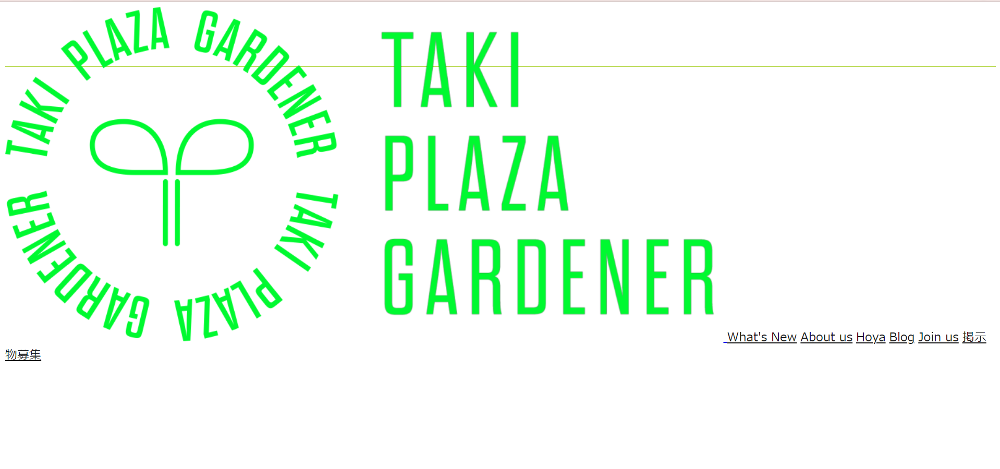

# 画像を挿入する

ヘッダーの一番左に TPG のアイコンが表示されているので、これを挿入します。新しく要素を追加するので、今回はまず HTML を使います。画像を挿入するときの書き方は次の通りです。

```html

```

画像のパス というところには html ファイルから見た画像の相対パスか、絶対パスを記述します。パスについては[こちら](#)を参照してください。TPG の公式 HP では、各 html ファイルと同じ階層に\_img フォルダを作成し、そのページで使う画像をその中に入れています。なのでまずは、html や css ファイルが置いてある HP ディレクトリ内に、\_img という名前のディレクトリを作成します。

　[使われている画像](https://portal.tpgd.jp/index.php/f/247585)をダウンロードし、先ほどの\_img フォルダに置いてください。


　あとはパスを指定するだけで画像の表示ができるのですが、ヘッダーではこの画像に tpgd.jp へのリンクが埋め込まれています。要素をリンクにするタグは a タグです。下記のように記述します。追加した部分は header タグのすぐ下だけです。

　 img タグには閉じタグがなく、``のように書きます。

```html
<header>
  <a href="/index.html">
    
  </a>
  <a href="https://www.test.tpgd.jp/whatsnew/index.html" class="header_item">What's New</a>
  <a
    href="https://www.test.tpgd.jp/aboutus/index.html#aboutus"
    class="header_item"
    >About us</a
  >
  <a href="https://www.test.tpgd.jp/hoya/index.html" class="header_item"
    >Hoya</a
  >
  <a href="https://www.test.tpgd.jp/blog/index.html" class="header_item"
    >Blog</a
  >
  <a href="https://www.test.tpgd.jp/joinus/index.html" class="header_item"
    >Join us</a
  >
  <a href="https://www.test.tpgd.jp/keijibutu/index.html" class="header_item"
    >掲示物募集</a
  >
</header>
```

一度作成したページを確認してみます。

　こんな感じで相当な崩れ方をしていると思います。画像のサイズを指定していないためです。

 CSS で画像に指定をします。画像には header_logo というクラスをつけているので、これを CSS で指定します。header_item よりも header_logo の方が先にくる要素なので、.header_item の前に書いた方が後々楽です。

```css
.header_logo {
  display: block;
  height: 60px;
  width: auto;
  margin: 15px 15px 15px 0px;
}
```

height と width で画像の縦幅と横幅を指定します。画像の縦横比が崩れてしまうので
どちらかを数値指定してもう片方を auto(縦横比が崩れないように自動)にすることが多いです。前回設定したヘッダーの高さが 90px で、画像の高さが 60px なので、上下均等に余白を撮るなら(90-60) / 2 = 15 で 15px ずつです。margin は余白を指定するプロパティです。余白については、次のページで書きます。

　 display でできることはいくつかありますが、今回は画像をブロック要素に変換する役割を持っています。画像は、デフォルトでは次に来る要素が改行されません。実際、display: block;を削除すると画像のすぐ右から What's New,...と続きます。要素の種類にはブロック要素、インラインブロック要素、インライン要素があります。詳しくは[そのうち解説](/learn/website/w01_intro/010_5/README.md)しますが、画像と a タグには`display: block;`を使うことが多いです。何かがうまくいかない、というときもまあこれを入れてみればうまくいくこともあるので覚えておいてください。
