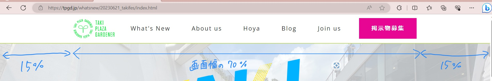

# 余白と div について

###### まず余白の話です。
　前回は margin で余白をつけました。余白には、margin と padding の 2 種類あります。簡単に言うと、margin は別の要素からどのくらい離れているかという意味での余白で、padding は余白をつけたい要素本体からどのくらい離れているかという意味での余白です。イメージ的には、パワーポイントにおけるテキストボックスをどこに配置するかという余白が margin で、テキストボックスのサイズが padding です(伝われ)。

　なので、基本要素の場所を制御したいときは margin を使い、枠線や下線をつけたいときなどには padding を使います。margin を使うときに padding を使っても大体はうまくいきますが、


　前回書いた、`margin: 15px 15px 15px 0`は、余白を上、右、下、左の順に指定しています。つまり、左側の余白のみ 0 です。上下、左右にそれぞれ同じサイズの余白を指定したい場合は、例えば`padding: 10px 20px;`と書けます。上下左右すべて同じサイズの余白を指定したい場合は、`margin: 10px;`と書けます。特定の方向にのみ余白をつけたい場合は、padding-top, margin-left など - でその方向を指定できます。


実際に[目標物のページ](https://tpgd.jp/whatsnew/20230621_takifes/index.html)では左にも余白があると思いますが、これは TPG アイコン画像に対する余白として空けた空間ではありません。画像や What's New などのボタンを等間隔に横並びにする際、画面幅いっぱいに広がりすぎると見栄えが良くないため、画面幅の 70％の範囲で等間隔に並んでね、という指示をしています。これについては、div という新しい概念を使います。

###### 次に div の話です。
　 div タグというものがあります。div は division(分割)の略です。つまり、区画をつくります。ブロックを作るというときもあります。例えば、[目標物のページ](https://tpgd.jp/whatsnew/20230621_takifes/index.html)の下の方に出てくる Artists 部分に並ぶ水色の要素は、div を一つ作り、その中に団体名やアイコン画像などを置いています。

```html
<div class="class_name">
  <!-- divはたくさん作るので、クラス名をつけるのが基本 -->
  <!-- ここにdivに含めたい要素を入れる -->
  <!-- グループ化という面もある -->
  <div class="secondary">
    <!-- divの中にdivを入れ階層構造にすることもよくある -->
  </div>
</div>
```

先ほどの、ヘッダーを画面幅の 70％いっぱいに広げる、ということをしたいときは、ヘッダーの要素(画像と、header_item すべて)を div の中にいれます。そしてその div に対して、`width: 70%;`を設定してあげればいいのです。

　ここで気をつけないといけないのは、HP の構成は上詰め・左詰めだということです。つまり、横幅を 70%に設定しただけでは中央揃えではなく左に寄ってしまいます。ですので、左側に余白 15％((100%-70%) / 2 )をとってあげれば中央に寄せることができます。中央寄せにするやりかたは他にもありますが、大きい要素を中央に置きたい場合はこのやり方が一番シンプルだと思います。


　右側を 15％に設定してもいいのですが、左余白と要素の幅が決まってしまえば自動的に右余白は全体からの差分になるので特に設定する必要はありません。また、左余白ではなく右余白を設定してもいいのですが、HP の構成要素は上詰め・左詰めのため、左余白を設定することが多いです。かなり右端にある要素には右余白のみ設定することもありますが、レスポンシブ対応(PC 版だけではなくスマートフォン、iPad で表示しても崩れないようにする)するときにややこしくなるので左余白の設定を強く勧めます。




　今回は、HTML をこのように header_items という div の中に入れます。

```html
<header>
  <div class="header_items">
    <a href="/index.html">
      
    </a>
    <a href="https://www.test.tpgd.jp/whatsnew/index.html" class="header_item">What's New</a>
    <a href="https://www.test.tpgd.jp/aboutus/index.html#aboutus" class="header_item">About us</a>
    <a href="https://www.test.tpgd.jp/hoya/index.html" class="header_item">Hoya</a>
    <a href="https://www.test.tpgd.jp/blog/index.html" class="header_item">Blog</a>
    <a href="https://www.test.tpgd.jp/joinus/index.html" class="header_item">Join us</a>
    <a href="https://www.test.tpgd.jp/keijibutu/index.html" class="header_item">掲示物募集</a>
  </div>
</header>
```

今回は header_items というクラスの中にある a タグに header_logo または header_item というクラス名を与えているので問題ありませんが、例えばある div の中にある a タグすべてに同じ処理をしたいとき、クラス名をいちいち記述するのは面倒ですしクラス名の種類がとんでもない量になります。

　そこで、`.class a{ `という書き方で class というクラス名の div の中にある a タグを指定できます。これはメイン部分の作成でよく使うので覚えておいてください。


　では次は CSS を書いて位置調整をしましょう。
