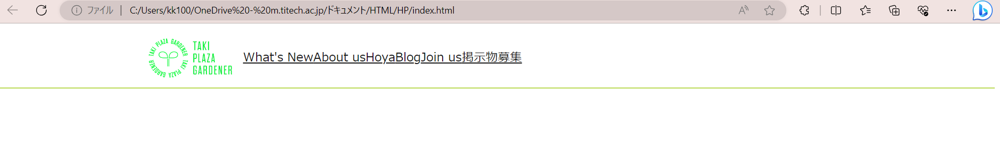

# ヘッダーの作成 ④ ヘッダーを整える
　前のページでヘッダーの要素をheader_itemsというdivの中に入れました。では、CSSファイルを開いてheader_itemsの横幅を70%、左側の余白を15%に設定しましょう。


　ここで、ある要素が入れ子構造になっている場合、上の要素を親要素、中にいる要素を子要素といいます。今回の場合、header_itemやheader_logoはheader_itemsクラスの子要素であり、逆にheader_itemsはheader_itemやheader_logoの親要素です。CSSでは親要素に対する記述を子要素に対する記述よりも先(上)に書いた方が管理しやすいため、header_itemsクラスに対する記述はheader_logoへの記述よりも前の行に記述することを勧めます。
```css
.header_items {
    width: 70%;<!-- 幅の指定 -->
    height: 90px;<!-- ヘッダーの高さは90px -->
    margin-left: 15%;<!-- 左余白 -->
    display: flex;
    text-align: center;
    align-items: center;
}
```
　`display: flex;`は、子要素を横並びにしたいときに親要素に設定する項目です。ポイントは、何かを横並びにしたいときには並べたい要素ではなくその親要素に対してこれを設定しなければならないということです。


　横並びの方法として、調べるとfloat: left(right);が出てくるかもしれません。ですが~~これは私が好きではない~~多くの構成要素を持つHP作成に向いていない(慣れるまで扱いづらい)と判断しTPGのHPには一切使っていません。今後も使わないことを推奨します。

　このページの最後にfloat: left;の説明も軽く書いておきますが、本当に使わないので興味がなければ読み飛ばしてください。


　text-alignとalign-itemsはそれぞれ左右と上下をどこにそろえるかを設定する行です。今回はどちらもcenterなので中央揃えですが、leftやrightも使えます。また、使える要素の種類にも制限があります。詳しくは[こちら](/w/w01_intro/010_5/README.md)で説明します。

今回は、このような状態になっていれば大丈夫です。今は横並びが左詰めになっているので、次はこれを広げます。





***
* [floatについて](https://udemy.benesse.co.jp/design/web-design/css-float.html)

リンク先のページの説明が一番わかりやすいと思うので読んでみてください。要はfloatというだけあって要素を浮かせているので、その下に別の要素が入り込んでしまうということです。もちろんその解除方法はありますが、CSSに書くべき行が増えるのであまり好きではありません。また、ページの複雑性が増すほど一カ所ミスしているだけで表示が崩れますが、floatはfloatの設定ミスなのか、clear(float解除)の設定忘れなのか、なんなのか即座に判断しづらいです(他人の書いたコードであればなおさら)。ちょっとした変更を行うときに注意が必要なのが難点かなと思っています。
