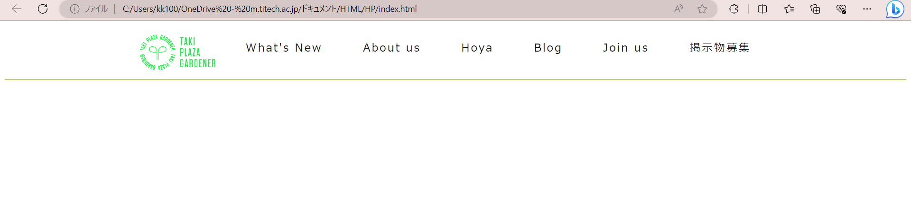

# ヘッダーの作成 ⑤ 横並びを整える
　今回は、横並びを幅いっぱい(幅70%に設定しているのでそこいっぱい)に広げます。TPGのページで使われているやり方は2通りあります。見た目にほぼ違いはないですが、若干のこだわりをもつなら適した方を選ぶ必要があります。


　一つは、親要素header_itemsに`justify-content: space-evently;`を設定することです。実際にやってみると、フォントや文字間隔などが異なるため違って見えるかもしれませんが、[目標物のページ](https://tpgd.jp/whatsnew/20230621_takifes/index.html)とほぼ同じ間隔になっていると思います。


　目標物のページでは、マウスをかざしたときに出る下線が隣同士の要素で繋がっています。これはpaddingで左右の余白をつくり、下線をつけることで実現できそうですが、肝心のpaddingで設定する値はいくつにすればいいのかわかりません。

　ですので今回は別のやり方をします。先ほどは親要素への設定をするパターンでしたが、今回使うのは子要素への設定をするパターンです。子要素header_itemに次のように記述します。
```css
.header_item {
    display: inline-block;/* aタグはblock要素にして使う場合が多いので、blockではないと即座にわかるようにするため */
    flex-grow: 1;/* 横並びにするための行(親要素にdisplay: flex;がある前提) */
    font-size: 1.2vw;
    color: #181818;
    text-decoration: none;/* 後述① */
    border-bottom: 2px solid #fff;/* マウスをかざさないときは下線がないため、見えないように白にしておく */
    letter-spacing: 0.12em;/* 後述② */
    padding-bottom: 0.75vw;/* 文字と下線との距離の間の余白 */
    white-space: nowrap;/* 後述③ */
}
```
　子要素にflex-glow: 1;を設定することで親要素の幅いっぱいに要素を広げることができます。ざっくり言って、子要素を等間隔に並べたいときは親要素にjustify-content、親要素の幅いっぱいに子要素を敷き詰めたいときはflex-glowです。


　後述①について、aタグはリンクになっているとわかるように、初めから下線がつけられていました。ですがこの下線は幅を変えたり、文字との間隔を空けたりすることができません。そこで`text-decoration: none;`でこのデフォルト下線を削除し、その次の行で改めて下線を設定しています。


　後述②について、これはletter-spacing(文字間隔)を0.12emに設定しています。emというのは親要素のフォントサイズに対する比率をとる単位です。つまり、文字の12%分の文字間隔をとっています。この行の有無を比べてみてください。デザイン的に結構変わります。


後述③について、これは画面幅が狭くなったときに、余白をある程度維持しようとして~~おせっかい~~親切で自動的に改行してくれるのを防ぐ行です。もともと改行されていないのにこれを設定した理由は、ブラウザの表示幅を狭めると改行されてしまったり、PCやブラウザの表示率によってはブラウザを最大化していても改行されてしまっていたからです。


　今回はこのようになっていれば大丈夫です。




　まだヘッダーしかやっていないのにこんなに、、、と思うかもしれませんが、実はHP制作(TPGの公式HP作成)に使ったHTML/CSSの知識はあと3つくらいを除いてほぼ終わりです。
