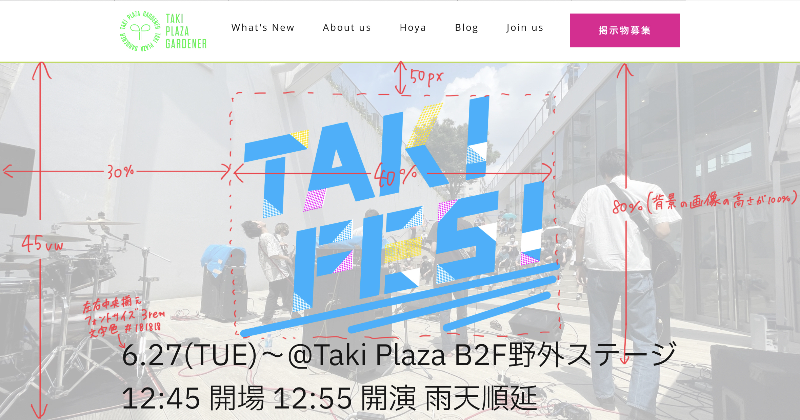

#   メイン部分をつくる①
　メイン部分(ヘッダーとフッター以外の部分)を作っていきます。

　まず、使う画像をまとめて[ポータル](https://portal.tpgd.jp/index.php/f/122296)に置くのでダウンロードし、_imgフォルダに入れてください。(ポータルにログインした状態でリンクを踏んでください、アクセス権ないと開けません)


　ここから先は、ほぼ全てこれまでの知識でできます。各部分で仕様書を提示するので、これまでのページを参照しながら自分でやってみてください。

　仕様書のあとに私が実際に書いているコードを参考として提示しますが、仕様書が再現できていればその通りでなくても構いません。クラス名などは自由なので、好きにやってください。

　仕様書は次の通りです。

　



　今回書くコードは次の通りです。


・HTML
```html
    <body>
        <header>
            /* ヘッダーの内容 */
        </header>
        <div class="top_image">
            
            
            <p>6.27(TUE)～@Taki Plaza B2F野外ステージ
                
12:45 開場 12:55 開演 雨天順延
            </p>
        </div>
        <footer></footer>
    </body>
```
・CSS
```css
.top_image {
    position: relative;    <!-- 相対位置の基準 -->
    width: 100%;
    height: 45vw;
    animation-name: fade;    <!-- 画面を読み込んだときにフェード表示されるようにする -->
    animation-duration: 2s;    <!-- フェードの時間は2秒 -->
}
.haikei {
    z-index: 0;    <!-- 一番下に来てほしい -->
    position: absolute;    <!-- top_imageの領域を基準とする絶対位置 -->
    display: block;    <!-- 画像なのでblock要素に変更 -->
    width: 100%;
    height: 45vw;
    object-fit: cover;    <!-- 後ほど解説 -->
}
.logo {
    z-index: 5;    <!-- 0より大きければいいんですが、とりあえず5。10はあとで使うので避けてください。 -->
    position: absolute;
    display: block;
    width: 40%;
    height: auto;    <!-- 縦横比が崩れないよう、横幅に合わせて自動的に縦幅をとる -->
    top: 50px;    <!-- top_imageの領域の上端から50px離れたところに置く -->
    left: 30%;    <!-- top_imageの領域の左端から30％離れたところに置く -->
}
.top_image p {    <!-- top_imageクラスの中にあるpタグを指定(クラス名を無闇に増やさずに済む) -->
    position: absolute;
    top: 80%;
    left: 50%;
    transform: translate(-50%, -50%);    <!-- 座標指定の基準点を移動 -->
    font-size: 3rem;
    color: #181818;
    white-space: nowrap;    <!-- 画面幅が狭くても勝手な改行が起きないように -->
}
```
　最後に、haikeiクラスに指定したobject-fitについて説明します。これは画像の縦幅と横幅を両方指定したときに使います。指定した縦横が画像の縦横比とずれていた場合、変に引き延ばされたり、足りない部分に画像が繰り返しでつなげられたり、長い方に合わせて拡大してはみ出た部分をカットしたりと対応方法はいくつかあります。今回の`object-fit: cover;`は、指定した領域(`width: 100%;` `height: 45vw;`)を覆うように画像を拡大して表示するという働きです。coverの部分には、contain(画像全体を表示する)を使うこともありますが、基本的にはcoverが便利です。それか先に画像をトリミングして置くのが手っ取り早いと思います。
