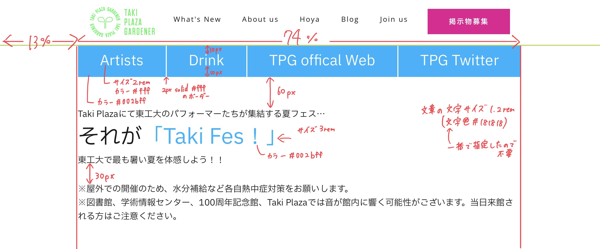

#   メイン部分をつくる②
　今回はメイン画像の下の文字の部分をつくります。仕様書は次の通りです。




　pタグでテキストを挿入できることは最初の方で書きましたが、改行は`<br>`を改行したい部分に挿入します。1行空きにしたい場合は`<br><br>`と2回改行すれば良いです。


　また、1行の中で特定の部分のみ色やサイズを変えたい場合は`span`タグを使います。pやh3などを使うと自動的に改行されてしまうので、きれいに1行に表示することが難しいです。

　そこで、pタグやh3タグの中で変更したい部分をspanタグで挟み、CSSを記述してあげれば良いのです。例えば、このようになります。
```html
<div class="ex">
    <p>文字の色を<span>ここだけ</span>変更する</p>
</div>
```
　spanタグにもクラス名を与えられるのでそれでCSSを記述しても良いですし、上記の例であれば`.ex span`のようにpタグなどテキストタグと同様に扱えます。テキストタグの中に含むことができるというのが最大の特徴です。


　今回のコードは次のようになります。
####    HTML
```html
        <div class="top_image">
            <!-- 前回作成した部分 -->
        </div>
        <div class="fade_takifes">        <!-- ここにdivを作成した理由は後ほど説明 -->
            <div class="buttons">
                <a href="#artists">Artists</a>      <!-- hrefで参照するリンクの# ~ については次のページで説明 -->
                <a href="#drink">Drink</a>
                <a href="https:///www.tpgd.jp">TPG offical Web</a>
                <a href="https://twitter.com/TPGardener" class="no_line">TPG Twitter</a>
            </div>
            <div class="setumei">
                <p>Taki Plazaにて東工大のパフォーマーたちが集結する夏フェス…
                    
<span>それが</span><span class="cl">「Taki Fes！」</span>
                    
東工大で最も暑い夏を体感しよう！！
                </p>
            </div>
            <div class="chuui">
                <p>※屋外での開催のため、水分補給など各自熱中症対策をお願いします。
                    
※図書館、学術情報センター、100周年記念館、Taki Plazaでは音が館内に響く可能性がございます。当日来館される方はご注意ください。
                </p>
            </div>
        </div>
```
####    CSS
```css
.fade_takifes {
    width: 74%;
    margin-left: 13%;
    animation-name: fade;    <!-- top_imageクラスと同じアニメーションを適用 -->
    animation-duration: 2s;
}
.buttons {
    display: flex;    <!-- 横並び -->
}
.buttons a {
    display: block;
    flex-grow: 1;    <!-- 親要素buttonsの幅いっぱいに -->
    text-align: center;    <!-- 文字を中央揃え -->
    color: #fff;
    font-size: 2rem;
    border-right: 2px solid #fff;    <!-- 右に仕切りの白い線をいれた -->
    background-color: #00b2ff;
    padding-top: 10px;
    padding-bottom: 10px;
}

.buttons a:hover {    <!-- ホバー処理 -->
    color: #00b2ff;
    background-color: #fff;
}

.setumei {
    margin-top: 60px;
}

.setumei p {
    font-size: 1.2rem;
    color: #181818;
}

.setumei span {
    font-size: 3rem;
}
.cl {
    color: #00b2ff
}

.chuui {
    margin-top: 30px;
}

.chuui p {
    font-size: 1.2rem;
}
```
　まず、外側にfade_takifesクラスのdivを作成した理由についてです。TPGの公式HPは、ページを開いたときにヘッダーより下の部分をフェード読み込みするようになっています。

　ヘッダーとフッターの間の部分それぞれにフェード処理するのは面倒なので1つのdivにいれてしまい、ついでに横幅の表示範囲もまとめて制限してしまおうということなのですが、このページでは前回作った画像の部分は横幅いっぱいに表示し、それより下は幅74％の範囲に表示しています。

　なので全てを1つのdivに入れることはできず、画像部分とそれより下の部分の2つの大きなdivを作成し、それぞれフェード処理しているというわけです。
