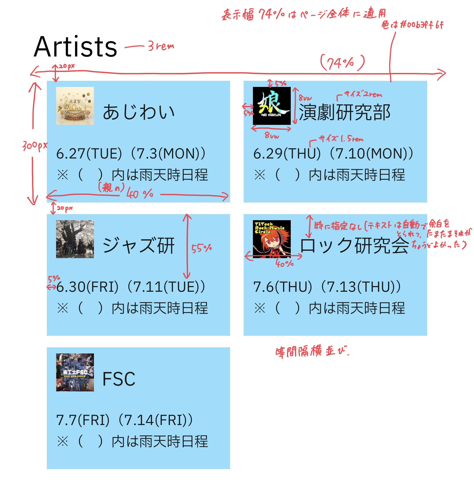

#   メイン部分をつくる③
　今回は出演団体一覧の部分をつくります。仕様書は次の通りです。




　ヘッダーを作るときもそうでしたが、同じような要素の繰り返しな場合は同じクラス名を付与しまとめて処理するのが基本になります。また、今回は使いませんが「ほぼ同じ要素の繰り返しなのにちょっとだけ違う(ex.divの構成は同じで背景色だけ違う)」という場合は共通のクラス名の他に、違う要素にだけもう一つクラス名を与えれば良いのです。


　今回のコードは次のようになります。
####    HTML
```html
        <div class="fade_takifes">
            <!-- 以前作成した部分 -->
            <h3 class="title" id="artists">Artists</h3>
            <div class="artists">
                <div class="item">
                    
                    <p class="name"> あじわい</p>
                    <p class="date">6.27(TUE)（7.3(MON)）
                        
※（　）内は雨天時日程
                    </p>
                </div>
                <div class="item">
                    
                    <p class="name"> 演劇研究部</p>
                    <p class="date">6.29(THU)（7.10(MON)）
                        
※（　）内は雨天時日程
                    </p>
                </div>
                <div class="item">
                    
                    <p class="name">ジャズ研</p>
                    <p class="date">6.30(FRI)（7.11(TUE)）
                        
※（　）内は雨天時日程
                    </p>
                </div>
                <div class="item">
                    
                    <p class="name">ロック研究会</p>
                    <p class="date">7.6(THU)（7.13(THU)）
                        
※（　）内は雨天時日程
                    </p>
                </div>
                <div class="item">
                    
                    <p class="name">FSC</p>
                    <p class="date">7.7(FRI)（7.14(FRI)）
                        
※（　）内は雨天時日程
                    </p>
                </div>
                <div class="item item2">
                </div>
            </div>
        </div>
```
####    CSS
```css
.title {
    font-size: 3rem;
    font-weight: normal;    <!-- h3はデフォルトで太字になっているので、太字を解除 -->
    margin-bottom: 0;
    padding-bottom: 0;
        <!-- 文字が詰まっていると見づらいため、テキストタグは何もしていなくてもpaddingやmarginが取られています。そこで変に余白が空いてしまうので0にしました。この辺は好みとデザインです。 -->
}
.artists {
    display: flex;    <!-- 横並び -->
    justify-content: space-evenly;    <!-- 等間隔配置(横並びを整える 参照) -->
    flex-wrap: wrap;    <!-- 幅いっぱいに覆ってね、という指定。justify-contentとセットだと思っておけば大丈夫 -->
}

.item {
    position: relative;    <!-- 座標指定の基準 -->
    width: 40%;
    height: 300px;
    margin-top: 20px;
    background-color: #00b3ff6f;
}

.item2 {    <!-- なぜitem2が必要かは後ほど説明 -->
    background-color: transparent;    <!-- 透明。見えなくなればいいなら白でも良いが、ページ全体に背景色やパターンをつける可能性が0ではなかったため透明にした。 -->
}

.item img {
    display: block;
    position: absolute;
    width: 8vw;
    height: 8vw;
    top: 5%;
    left: 5%;
}
.name {
    position: absolute;
    font-size: 2rem;
    left: 40%;
}
.date {
    position: absolute;
    font-size: 1.5rem;
    top: 55%;
    left: 5%;
}
```
　出演団体ごとにdivをつくり、divやその中の要素にそれぞれ共通のクラス名を与えることで同じ構成を簡単に5団体用意できます。

　ここで、htmlの最後の方でitemの他にitem2というクラスが与えられた空のdiv(divの中に含まれる要素がない)があることに注目します。これがあるときとないときを比べるとわかるのですが、ないと5個目のdiv(FSCのdiv)が左側ではなく中央に配置されてしまいます。これは、item要素の親要素であるartistsクラスに対して、子要素の幅を自身の幅の40％とし等間隔に横並びにしてね、という指示をしているためです。

　なので、画像やテキストという要素は持たないけれどitem要素と同じ幅と高さをもつ領域を作成してあげればFSCの領域とこの領域が横並びになるので、FSCは左列にそろえられるというわけです。しかしitemは背景色を水色にしているので、調整のためにつくった最後のdivは透明にしてあげる必要があります。
