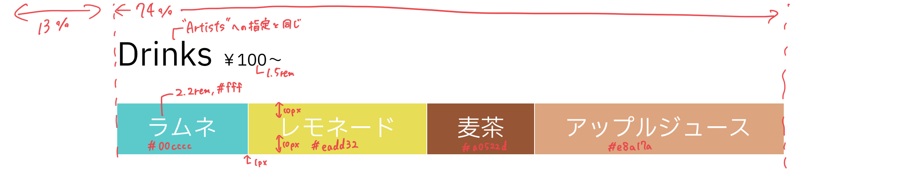

#   メイン部分をつくる③
　今回は飲み物一覧の部分をつくります。仕様書は次の通りです。




　同じような要素の繰り返しな場合は同じクラス名を付与しまとめて処理するのが基本だと書きました。ArtistsとDrinkは同じ文字色やサイズの見出しであるため、同じクラス名を使えば改めてDrinkの方で見出しの処理を書く必要がなくなります。

　いかにコードを省略するかや、どのように位置指定をするかはかなり個人差が出る部分です。


　今回のコードは次のようになります。
####    HTML
```html
        <div class="fade_takifes">
            <!-- 以前作成した部分 -->
            <h3 class="title" id="drink">Drinks <span class="nedan">￥100～</span></h3>
            <div class="drinks">
                <p class="drink1">ラムネ</p>
                <p class="drink2">レモネード</p>
                <p class="drink3">麦茶</p>
                <p class="drink4">アップルジュース</p>
            </div>
        </div>
```
####    CSS
```css
.nedan {
    font-size: 1.5rem;
    font-weight: normal;
}
.drinks {
    position: relative;
    display: flex;
}
.drinks p {
    font-size: 2.2rem;
    flex-grow: 1;    <!-- 横並び。余白が不要&テキストで横幅不明なのでjustify-contentではなくこれを使う -->
    color: #fff;
    text-align: center;    <!-- 文字を左右中央揃え -->
    padding-top: 10px;    <!-- 上下に同じ幅を取って上下中央揃え -->
    padding-bottom: 10px;
}
.drink1 {
    background-color: #00cccc;
    border-right: 1px solid #fff;
}

.drink2 {
    background-color: #eadd32;
    border-right: 1px solid #fff;
}

.drink3 {
    background-color: #a0522d;
    border-right: 1px solid #fff;
}

.drink4 {
    background-color: #e8a17a;
}
```
　今回は特にこれといってポイントはないです。きれいな横並びの作り方は主に2つあり、サイズの決まっている要素を等間隔に並べたいときは`justify-content`、幅が決まっていない要素を親要素の幅いっぱいに並べたいときは`flex-grow`がいいという話を[こちら](/w/w01_intro/011/README.md)に書きました。

　横並び指示を親要素に書くか子要素に書くかなど間違えやすいので気をつけてください。
