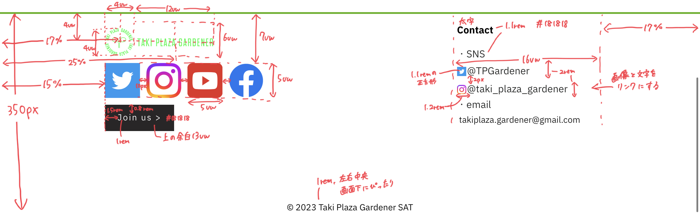

#   フッターをつくる
　今回はフッターをつくります。仕様書は次の通りです。




　まず、フッターに必要な画像を[ポータル](https://portal.tpgd.jp/index.php/f/122308)からダウンロードして_imgフォルダにいれてください。

要素が多いので手間はかかりますが、これまで使った知識だけでできるのでやってみてください。


　今回のコードは次のようになります。
####    HTML
```html
        <div class="fade_takifes">
            <!-- 以前作成した部分 -->
        </div>
        <footer>
            <div class="footer_items">
                
                
                <div class="sns">
                    <a href="https://twitter.com/TPGardener">
                        
                    </a>
                    <a href="https://www.instagram.com/taki_plaza_gardener/">
                        
                    </a>
                    <a href="https://www.youtube.com/channel/UCwU5xd_dpFeJK5kAVBXGRLg/featured">
                        
                    </a>
                    <a href="https://www.facebook.com/TakiPlazaGardener.tokyotech/">
                        
                    </a>
                </div>
                <div class = footer_btn>
                    <a href="/joinus/index.html">Join us ></a>
                </div>
                <div class="contact">
                    <h3>Contact</h3>
                    <div class="list">
                        <p>・SNS</p>
                        <div class="sns_id">
                            
                        <p class="footer_text">@TPGardener</p>
                        <a href="https://twitter.com/TPGardener"></a>
                        </div>
                        <div class="sns_id">
                            
                            <p class="footer_text">@taki_plaza_gardener</p>
                            <a href="https://www.instagram.com/taki_plaza_gardener/"></a>
                        </div>
                        <p>・email

                            <a href="#" class="footer_text">takiplaza.gardener@gmail.com</a>
                        </p>
                    </div>
                </div>   
                <h3 class="c">© 2023 Taki Plaza Gardener SAT</h3>
            </div>
        </footer>
    </body>
</html>
```
####    CSS
```css
footer {
    position: relative;
    width: 100%;
    height: 350px;
    border-top: 3px solid #5CB200;
    background-color: #fff;
    font-family: 'IBM Plex Sans JP', sans-serif;
}
.tpgicon {
    position: absolute;
    display: block;
    height: 4vw;
    width: 4vw;
    transform: translate(-50%,-50%);
    top: 4vw;
    left: 17%;
}
.tpg_line {
    position: absolute;
    display: block;
    height: 6vw;
    width: 12vw;
    transform: translate(-50%,-50%);
    top: 4vw;
    left: 25%;
}
.sns {
    position: absolute;
    display: flex;
    left: 15%;
    top: 7vw;
}
.snsicon {
    width: 5vw;
    height: 5vw;
    margin-right: 10px;
}
.footer_btn {
    position: absolute;
    display: block;
    left: 15%;
    top: 13vw;
}
.footer_btn a{
    color: #fff;
    font-size: 1rem;
    letter-spacing: 0.12em;
    padding: 0.8rem 1.5rem;
    background-color: #181818;
}
.footer_btn a:hover {
    color :#282626;
    background-color: #fff;
    border: 0.5px solid #181818;
}
.contact {
    position: absolute;
    right: 17%;
}
.contact h3{
    font-size: 1.1rem;
}
.list p{
    font-size: 1.1rem;
    color: #181818;
    padding: 0;
    margin: 0;
}
.sns_id {
    position: relative;
    display: flex;
    width: 16vw;
    height: 2rem;
    margin-top: 2px;
}
.sns_id img {
    position: absolute;
    display: block;
    width: 1.1rem;
    height: 1.1rem;
    transform: translate(0, -50%);
    top: 50%;
    left: 0;
}
.sns_id p{
    position: absolute;
    transform: translate(0, -50%);
    top: 50%;
    left: 1.2rem;
}
.sns_id a{
    position: absolute;
    display: block;
    width: 100%;
    height: 100%;
    top: 0;
    left: 0;
}
.list a{
    color: #181818;
}
.c{
    position: absolute;
    margin-bottom: 0;
    bottom: 0;
    left: 50%;
    transform: translate(-50%,-50%);
    font-weight: normal;
    font-size: 1rem;
}

```
　ここで、目標物のページでは画面をスクロールしてもヘッダーがずっと表示されているのに対し、これまで作ってきたページでは隠れてしまっています。

　要素の固定表示は`position: fixed;`でやります。headerにこれを追加してください。また、~~お節介で~~ヘッダーに余白を取ってくれてずれてしまうことがあるので、`top: 0;`を追加します。普通であればmarginなのですが、headerは他の要素と違い独自にタグがあるように、ちょっと違うんだなーと思ってもらえれば大丈夫です。

ここで気をつけるべきは、fixedされた要素は浮いているような状態になるため、その下の要素がヘッダーの高さ分上に詰まり、少し隠れてしまうということです。なので、HTML上で`header`の次の要素である`top_image`に対して、`margin-top: 90px;`をします。これで整いました。


　ヘッダーを固定したことにより、ArtistsやDrinkボタンで飛ぶ先も90px分下にずれてしまいます。本来であればこれは修正すべきなのですが、Artistsというタイトルがヘッダーに隠れてしまっても問題ないこと、Drinkボタンは、Drinkの項目の高さ+フッターの高さが画面の縦よりも短いため、上にずれることがなく偶然ちょうど表示されているように見えます。なので今回は対応はいりません。


　対応が必要なときは、idをつけた要素に対して`padding-top: 90px; margin-top: -90px;`を設定します。これにより、idをつけた要素の上端が90px上に広がりこの広がった部分がちょうどヘッダーに重なります。しかしこれではこれまでなかった余白90pxが表示されてしまうので、marginでマイナス値を取ることで相殺しています。

　ここまでで、PC版のページが完成です。公式HPはスマホ版、タブレット端末版も作る必要があります。
